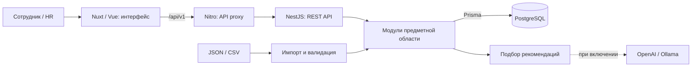

# QCareer — Career Quest

**Сервис развития сотрудников: от текущих навыков до конкретного следующего шага.**

QCareer помогает сотруднику понять, каких навыков не хватает для следующего грейда, выбрать подходящее обучение и увидеть изменение своего прогресса после выполнения. HR получает общую картину дефицитов навыков, участия в обучении и покрытия сотрудников рекомендациями.

Проект связывает профили сотрудников, требования к ролям и грейдам, каталог развивающих активностей и историю участия. Рекомендации учитывают эти данные и сопровождаются объяснениями. В репозитории реализованы веб-интерфейс, серверное API и хранение данных в PostgreSQL.

## Что реализовано

| Для кого | Возможности |
| --- | --- |
| Сотрудник | Вход по логину и паролю; просмотр профиля, навыков, следующего грейда и дефицитов; получение до трёх рекомендаций с объяснениями и ожидаемым эффектом; оценка полезности рекомендаций. |
| Сотрудник | Каталог активностей с фильтром по формату и пагинацией; просмотр условий и дат; запись, изменение статуса участия и завершение; история и результат изменения навыков. |
| HR | Сводка по сотрудникам, дефицитам навыков, участию и рекомендациям; наблюдаемые сигналы, требующие внимания; список сотрудников с фильтрами и просмотр индивидуального профиля. |
| HR | Импорт JSON/CSV: предварительная проверка, диагностика ошибок, применение пакета и повторный просмотр сохранённого отчёта. |

Права проверяются сервером: сотрудник работает со своими данными, HR получает доступ к аналитике и импорту. Профили, участие, изменения навыков, рекомендации и отчёты импорта сохраняются в базе. Повторный запрос завершения одного участия не начисляет прирост навыков второй раз.

## Как работает решение

1. **Загрузка данных.** При первом запуске сервер импортирует каталог навыков и требований, профили сотрудников, активности и историю участия. HR может позже загрузить дополнительные данные через интерфейс.
2. **Расчёт траектории.** После входа сотрудник видит текущие навыки и требования следующего грейда своей роли. Сервер рассчитывает готовность и показывает недостающие уровни.
3. **Подбор активностей.** Сервер проверяет аудиторию, начальные требования, доступные сессии, повторяемость и полезный прирост. Подходящие активности ранжируются с учётом дефицитов, роли, истории участия, новизны и обратной связи.
4. **Необязательный этап AI.** Если LLM подключена, она выбирает и упорядочивает активности из подготовленного списка. Сервер проверяет ответ, рассчитывает числовые эффекты и формирует объяснения на основе подтверждённых данных.
5. **Действие сотрудника.** Сотрудник записывается на активность и отмечает её завершение. Сервер сохраняет участие, начисляет допустимый прирост навыков и пересчитывает готовность.
6. **Новый результат.** Предыдущий подбор становится устаревшим; сотрудник обновляет рекомендации с учётом нового состояния. HR видит сохранённые данные в профиле и аналитике.

Готовность к следующему грейду — доля покрытых требований: `100 × Σ min(текущий уровень, требуемый уровень) / Σ требуемых уровней`. Это расчётный показатель соответствия требованиям, а не вероятность повышения. При недостаточных данных интерфейс показывает отдельное состояние.

**По умолчанию LLM отключена:** приложение использует серверный подбор по правилам (`RULES_FALLBACK`, `aiUsed=false`). При ошибке, таймауте или невалидном ответе подключённой модели также используется этот режим. Основной сценарий доступен без внешнего AI-сервиса и API-ключа.

## Технологии

| Компонент | Используется в репозитории |
| --- | --- |
| Языки | TypeScript на backend; JavaScript и Vue-компоненты на frontend; CSS и SQL-миграции. |
| Frontend | Nuxt 4, Vue 3, Vue Router, Tailwind CSS, Nitro. Приложение работает как SPA (`ssr: false`). |
| Backend | Node.js, NestJS 11 с Express, REST API, Swagger / OpenAPI. |
| Данные | PostgreSQL 17.6, Prisma 6.19, миграции и начальный импорт. |
| Валидация и доступ | Zod, `csv-parse`, JWT (`jsonwebtoken`), Helmet; пароли хешируются через `scrypt` из Node.js. |
| Облачный AI, опционально | Адаптер OpenAI Responses API со структурированным JSON-ответом. Значение `LLM_MODEL` по умолчанию — `gpt-4.1-mini`; фактическое включение требует настройки провайдера. |
| Локальный AI, опционально | Адаптер нативного API Ollama: проверка модели и запрос `/api/chat`. Конкретная локальная модель в репозитории не закреплена. |
| Проверки | Jest, Supertest, тесты через Node.js, Playwright, TypeScript, ESLint на backend. |
| Окружение | Docker и Docker Compose; Docker-образы Node.js 22.20.0 и PostgreSQL 17.6. |

Версии зависимостей и команды зафиксированы в [backend/package.json](backend/package.json), [frontend/package.json](frontend/package.json) и соответствующих `package-lock.json`.

## Архитектура проекта



Backend построен как **модульный монолит**. Внутри модулей разделены бизнес-правила, пользовательские операции, инфраструктура и HTTP-контроллеры.

| Модули backend | Ответственность |
| --- | --- |
| `identity-access`, `employees` | Авторизация, роли доступа и профили сотрудников. |
| `competency-catalog`, `learning-catalog` | Навыки, роли, грейды, требования и каталог активностей. |
| `development` | Траектория, доступность активностей, участие и журнал изменения навыков. |
| `recommendations` | Ранжирование, адаптеры LLM, проверка объяснений, хранение подборов и обратной связи. |
| `hr-analytics` | Сводные показатели и представления для HR. |
| `dataset-import`, `health` | Импорт с диагностикой и проверка работоспособности приложения. |

```text
.
├── frontend/
│   ├── app/                  # Страницы, компоненты, работа с API
│   ├── server/routes/        # Proxy /api и проверка готовности
│   └── tests/                # Тесты клиента и браузерные сценарии
├── backend/
│   ├── src/modules/          # Бизнес-модули
│   ├── prisma/               # Схема БД и миграции
│   ├── data/fixtures/        # Синтетический набор для демонстрации
│   ├── scripts/              # Bootstrap, импорт, smoke и оценка рекомендаций
│   ├── test/                 # Unit, integration, E2E и архитектурные тесты
│   └── docs/                 # Контракты данных и описание алгоритмов
├── docs/                     # Интеграция frontend/backend, OpenAPI, отчёты
├── compose.yaml              # Общий запуск приложения
└── .env.example              # Пример настроек локального окружения
```

Браузер обращается к `/api/v1` на том же адресе, что и frontend. Nitro пересылает запросы в NestJS: в Compose это `http://api:3001`. Бизнес-данные приходят из backend; токен сессии хранится в `sessionStorage`. PostgreSQL использует постоянный Docker volume.

Подробности: [архитектура backend](backend/docs/architecture.md), [связь экранов с API](docs/api-integration.md), [алгоритм рекомендаций](backend/docs/recommendation-engine.md).

## Установка и запуск

### Быстрый запуск через Docker

Потребуются Docker Engine / Docker Desktop с Linux-контейнерами, Docker Compose **2.24+**, свободные порты **3000** и **3001**, доступ к реестрам Docker и npm при первой сборке. Локально устанавливать Node.js для этого способа не нужно.

1. Откройте терминал в корне репозитория, где находится `compose.yaml`.
2. Запустите приложение:

   ```bash
   docker compose up --build -d
   ```

3. Проверьте состояние:

   ```bash
   docker compose ps -a
   ```

   Ожидается: `postgres`, `api`, `frontend` — `Up (healthy)`; одноразовые `migrate` и `bootstrap` — `Exited (0)`. При первой сборке дождитесь окончания установки зависимостей, миграций и импорта.

4. Откройте [http://localhost:3000](http://localhost:3000).

В свежем окружении `.env` не обязателен: примеры настроек включают синтетические данные (`DATA_MODE=fixtures`), демонстрационные аккаунты и отключённую LLM. **Если уже существует `backend/.env` или корневой `.env`, его значения могут изменить этот режим и данные входа.**

| Адрес по умолчанию | Назначение |
| --- | --- |
| [localhost:3000/login](http://localhost:3000/login) | Вход в приложение. |
| [localhost:3001/docs](http://localhost:3001/docs) | Swagger UI для проверки API. |
| [localhost:3001/openapi.json](http://localhost:3001/openapi.json) | OpenAPI-спецификация работающего backend. |
| `http://localhost:3000/api/v1` | Базовый адрес API через frontend proxy. |
| `http://localhost:3001/api/v1` | Базовый адрес API напрямую. |
| [localhost:3001/health/ready](http://localhost:3001/health/ready) | Готовность backend и PostgreSQL. |
| [localhost:3000/health/ready](http://localhost:3000/health/ready) | Готовность frontend и доступность backend. |

Демонстрационные учётные записи **для новой базы с настройками из примеров**:

| Роль | Логин | Пароль |
| --- | --- | --- |
| Сотрудник, профиль `fixture_person_a` | `employee` | `change-this-demo-employee-password` |
| HR | `hr` | `change-this-demo-hr-password` |

Это опубликованные настройки локальной демонстрации. Перед публичным размещением нужны собственные секреты и настройка пользователей: production-конфигурация запрещает demo mode. Seed создаёт только отсутствующие аккаунты; изменение пароля в `.env` не меняет пароль уже созданного пользователя.

### Настройки окружения

Чтобы переопределить настройки, создайте корневой `.env` на основе [.env.example](.env.example), если такого файла ещё нет: `cp .env.example .env` в Bash или `Copy-Item .env.example .env` в PowerShell.

При общем запуске порядок файлов: `backend/.env.example` → `backend/.env` при наличии → корневой `.env` при наличии. Значения из секции `environment` Compose имеют приоритет; в частности, Compose задаёт адрес PostgreSQL внутри Docker. Необязательные URL и даты следует удалять или комментировать, а не задавать пустой строкой.

| Переменные | Назначение |
| --- | --- |
| `FRONTEND_PORT`, `PORT` | Порты хоста: по умолчанию `3000` и `3001`. |
| `POSTGRES_USER`, `POSTGRES_PASSWORD`, `POSTGRES_DB` | Параметры базы; Compose формирует `DATABASE_URL` автоматически. |
| `JWT_SECRET`, `JWT_TTL_SECONDS` | Секрет подписи от 32 символов и срок жизни токена; по умолчанию 3600 секунд. |
| `DEMO_MODE`, `DEMO_*` | Создание демонстрационных аккаунтов, их логины, пароли и ID сотрудника. |
| `DATA_MODE`, `INPUT_DATA_DIR` | `fixtures` или `input`; входной каталог по умолчанию `./data/input` относительно `backend/`. |
| `AS_OF_DATE` | Необязательная бизнес-дата; иначе используется дата среза набора. |
| `LLM_PROVIDER` | `disabled`, `openai` или `local`. |
| `LLM_MODEL`, `LLM_BASE_URL`, `LLM_API_KEY` | Имя модели, адрес провайдера и ключ, если он требуется. Только настройки backend. |
| `LLM_TIMEOUT_MS`, `ALLOW_EXTERNAL_LLM` | Таймаут модели: по умолчанию 5000 мс; разрешение внешней передачи: по умолчанию `false`. |

Для OpenAI нужны `LLM_PROVIDER=openai`, доступная модель, `LLM_API_KEY` и явное `ALLOW_EXTERNAL_LLM=true`. Для Ollama нужны `LLM_PROVIDER=local`, запущенный Ollama и заранее загруженная модель в `LLM_MODEL`. Локальный адрес по умолчанию — `http://127.0.0.1:11434`.

В Docker `127.0.0.1` указывает на сам контейнер API. Для Ollama на хосте или в другом контейнере задаётся доступный backend адрес; текущий адаптер требует `ALLOW_EXTERNAL_LLM=true` для любого имени хоста вне `localhost`, `127.0.0.1`, `[::1]`. Ollama и модели не устанавливаются общим Compose автоматически. Подробности протокола и ограничений — в [документации рекомендаций](backend/docs/recommendation-engine.md).

### Остановка и диагностика

```bash
docker compose logs --tail=100 frontend api migrate bootstrap postgres
docker compose stop
docker compose start
```

`docker compose down` удаляет контейнеры, сохраняя данные в volume `career-quest_postgres_data`. Для обычной остановки не добавляйте `-v`: этот флаг удаляет volume с данными. После изменения кода или конфигурации повторите `docker compose up --build -d`.

Существующий volume сохраняет прогресс. Смена `POSTGRES_PASSWORD` в файле не изменяет пароль уже инициализированной базы. Корневой и backend Compose используют одно имя проекта; запускайте их согласованно.

### Разработка без контейнера frontend

Нужны Node.js **22.16–24** и npm. Сначала запустите общий стек, затем из корня освободите порт frontend и запустите Nuxt:

```bash
docker compose stop frontend
cd frontend
npm ci
npm run dev
```

Dev server использует proxy на `http://127.0.0.1:3001`; другой адрес backend задаётся через `NUXT_API_BASE`. Публичная настройка `NUXT_PUBLIC_API_BASE` по умолчанию равна `/api/v1`. Если PowerShell блокирует `npm.ps1`, используйте `npm.cmd`.

Полный запуск backend как Node.js-процесса с отдельной PostgreSQL, команды миграций и сборки описаны в [backend/README.md](backend/README.md).

## Как проверить решение

### Сценарий для жюри

Сценарий рассчитан на **свежую базу со встроенным набором `backend/data/fixtures`** и настройками входа выше. Перезапуск уже использованной базы не сбрасывает навыки и завершённые активности.

| Шаг | Действие | Ожидаемый результат |
| --- | --- | --- |
| 1 | Войти на `/login` как `employee`. Открыть профиль и «Траекторию» (`/path`). | Профиль `Synthetic Demo A`, роль `Fixture Engineer`, грейд `Apprentice`, следующий грейд `Practitioner`. System Design — 1, готовность — 50%. |
| 2 | Открыть `/recommendations`, нажать «Подобрать заново». | До трёх доступных шагов с объяснениями и ожидаемыми изменениями навыков. При стандартной конфигурации указан подбор по правилам. |
| 3 | Открыть [курс System Design](http://localhost:3000/event?id=FX_DESIGN_COURSE) и нажать «Записаться». | Курс `Synthetic System Design Course` появляется в списке участия (`/activities`). Формат — самостоятельное обучение, без ожидания будущей сессии. |
| 4 | В `/activities` завершить этот курс кнопкой «Завершить». | Экран результата показывает System Design **1 → 2**, готовность **50% → 60%**. Грейд остаётся прежним. |
| 5 | Перезагрузить страницу результата, затем открыть профиль и историю. | Сохранённое завершение и новые значения повторно загружаются из backend. |
| 6 | Ещё раз обновить рекомендации. | Подбор учитывает новые навыки; завершённый неповторяемый курс исключён. |
| 7 | Выйти и войти как `hr`. Открыть `/hr-dashboard`, `/hr-people` и профиль сотрудника. | Доступны HR-сводки, список из шести исходных профилей, актуальные навыки и история сотрудника. |
| 8 | В `/import` выбрать четыре файла данных и `dataset-rules.json` из `backend/data/fixtures`. Нажать «1. Проверить пакет», затем «2. Применить импорт». | Появляются отчёты `VALIDATED` и `APPLIED`. Повторный импорт неизменённого набора сохраняет накопленный прогресс. |

Числа в шаге 4 следуют из правил демонстрационного каталога: курс даёт `+1` к System Design, а сумма требований следующего грейда равна 10. Это иллюстрация расчёта на синтетических данных, а не измерение реального профессионального роста.

Для проверки API без интерфейса используйте [Swagger](http://localhost:3001/docs) и [сценарии с HTTP-запросами](backend/docs/demo.md). API возвращает JWT при входе; защищённые запросы используют `Authorization: Bearer <token>`.

### Автоматические проверки

Backend, команды из корня репозитория:

```bash
cd backend
npm ci
npm run prisma:generate
npm run lint
npm run typecheck
npm run build
npm test
npm run test:architecture
```

Для integration/E2E с настоящей изолированной PostgreSQL, находясь в `backend/`:

```bash
node scripts/test-postgres.mjs
```

Скрипт создаёт отдельную тестовую базу, применяет миграции и останавливает PostgreSQL после проверок. Вариант с Docker и `TEST_DATABASE_URL` описан в [инструкции backend](backend/README.md).

Frontend, в отдельном терминале из корня:

```bash
cd frontend
npm ci
npm run typecheck
npm run build
npm test
npx playwright install chromium
npm run test:e2e
```

Браузерным тестам нужен запущенный локальный стек со встроенным набором данных. Они изменяют участие и прогресс; используйте демонстрационное окружение. При изменённых аккаунтах задайте `E2E_EMPLOYEE_USERNAME`, `E2E_EMPLOYEE_PASSWORD`, `E2E_HR_USERNAME`, `E2E_HR_PASSWORD`; адрес — `E2E_BASE_URL` (по умолчанию `http://127.0.0.1:3000`).

Сохранённые отчёты о ранее выполненных проверках находятся в [docs/verification.md](docs/verification.md) и [backend/docs/verification.md](backend/docs/verification.md). Наличие этих отчётов не заменяет запуск проверок в новом окружении.

## Данные и интеграции

Основной источник данных — импортируемые файлы. Стандартный запуск использует **6 синтетических профилей, 4 навыка, 8 активностей и 7 записей истории** из [backend/data/fixtures](backend/data/fixtures/README.md). Дата среза — **2026-10-01**. Это специально созданный набор для разработки и проверки, не реальные данные сотрудников и не данные жюри.

| Файл | Содержимое |
| --- | --- |
| `skills.json` | Навыки, шкала 0–5, профили ролей, грейды и требования. |
| `employees.json` | Профили, исходные уровни навыков, дата оценки и сохранённая карьерная цель. |
| `events.json` | Активности, аудитории, форматы, даты, начальные требования и правила прироста навыков. |
| `activity_history.csv` | История участия со статусами, датами и результатами. |
| `dataset-rules.json` | Необязательные правила: дата среза, трактовка отсутствующих навыков, базовая оценка, порядок грейдов и повторяемость. |

Для собственного набора создайте `backend/data/input`, поместите туда четыре обязательных файла и при необходимости `dataset-rules.json`. В корневом `.env` задайте `DATA_MODE=input` и, при включённом demo mode, `DEMO_EMPLOYEE_ID` существующего профиля. Затем выполните `docker compose up --build -d`. При отсутствии или невалидности обязательных файлов bootstrap останавливается с ошибкой; входные данные автоматически не заменяются демонстрационными.

HR-импорт допускает полный или частичный пакет: до **5 файлов по 8 МиБ**, с указанными именами. Сначала выполняется проверка без изменения профилей и истории, затем применение. Ссылки между сущностями проверяются; отклонённый пакет не вносит частичных бизнес-изменений. Структура и правила описаны в [контракте данных](backend/docs/data-contract.md).

Внешние интеграции, реализованные в коде, — необязательные **OpenAI** и **Ollama** для выбора рекомендаций. В модель передаются отобранные варианты и ограниченный контекст навыков, требований и истории, без имён сотрудников и полного массива профилей. При `LLM_PROVIDER=disabled` обращения к модели отсутствуют.

Каталог обучения загружается из файлов; подключений к внешним LMS, HR-системам, календарям и корпоративному SSO в текущем API нет. Файлы в `frontend/app/data` и прежний локальный движок сохранены в репозитории, но рабочий интерфейс использует данные backend.

## Ограничения текущей версии

- Нет самостоятельной регистрации, восстановления или смены пароля, обновления JWT и production-подключения SSO. После истечения токена нужен повторный вход.
- Нет отдельной формы или endpoint для редактирования профиля и карьерной цели; HR может обновить эти сведения через импорт. Пересмотр исходной оценки навыков не реализован: изменение уже импортированной базовой оценки отклоняется как конфликт.
- Траектория рассчитывается к следующему грейду текущей роли; сохранённая карьерная цель отображается отдельно. Автоматическое повышение грейда не выполняется.
- Отметка о завершении поступает от пользователя. Прохождение курса не подтверждается внешней образовательной системой; изменение навыков рассчитывается по правилам каталога.
- Результат зависит от качества импортированных оценок и требований. Если данных недостаточно, следующего грейда нет или подходящих активностей не осталось, система возвращает соответствующее состояние без рекомендаций.
- Подбор по правилам — инженерная эвристика. Репозиторий не подтверждает рост вовлечённости или качество рекомендаций на реальных данных жюри. Наличие адаптеров LLM не означает, что внешний AI включён или проверен в конкретном окружении.
- Интерфейс русскоязычный. Backend поддерживает локализованные данные и объяснения `ru`, `kk`, `en`; отсутствующие переводы каталога заменяются исходным текстом.
- Нет полнотекстового поиска по каталогу и поиска сотрудников по ФИО. Фильтры HR используют точные значения подразделения, роли и грейда.
- У импортированной истории может не быть подробного результата изменения навыков. CSV не содержит точного времени завершения самостоятельного обучения; восстановление истории использует доступную дату по описанным правилам.
- Доступность сессий и стандартное окно HR-аналитики привязаны к дате среза набора, а не автоматически к текущей дате компьютера. Сигналы HR отражают наблюдаемые данные; прогнозирования увольнений или мотивации нет.
- Docker-конфигурация предназначена для локального запуска: HTTP-порты привязаны к `127.0.0.1`, PostgreSQL не публикует порт на хост. Публичное размещение требует отдельной настройки окружения и доступа.

## Развёрнутая версия

Подтверждённая ссылка на публично развёрнутое приложение **в репозитории не указана**. После локального запуска приложение доступно по адресу [http://localhost:3000](http://localhost:3000).
