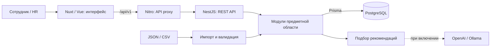

# QCareer — Career Quest

**Сервис развития сотрудников: от текущих навыков до конкретного следующего шага.**

Текущие исправления повторного аудита ТЗ и результаты проверки: [docs/weakness-verification.md](docs/weakness-verification.md). Предыдущие проверки сохранены как история: [до слияния языков](docs/fixes-verification.md), [после слияния](docs/merge-verification.md).

Nuxt 4 + Vue 3 frontend и существующий NestJS + Prisma + PostgreSQL backend. Интерфейс получает данные через API; импорт, рекомендации, участие и прогресс сохраняются в PostgreSQL. Контракты экранов и ограничения описаны в [docs/api-integration.md](docs/api-integration.md).

QCareer помогает сотруднику понять, каких навыков не хватает для следующего грейда, выбрать подходящее обучение и увидеть изменение своего прогресса после выполнения. HR получает общую картину дефицитов навыков, участия в обучении и покрытия сотрудников рекомендациями.

Проект связывает профили сотрудников, требования к ролям и грейдам, каталог развивающих активностей и историю участия. Рекомендации учитывают эти данные и сопровождаются объяснениями. В репозитории реализованы веб-интерфейс, серверное API и хранение данных в PostgreSQL.

Грейд — уровень должности; активность — курс, практикум или другое обучающее мероприятие; HR — кадровая служба. LLM — языковая AI-модель, которую можно дополнительно подключить для выбора рекомендаций.

**Для первого запуска достаточно Docker:** он запускает интерфейс, backend и базу данных вместе. Данные для демонстрации уже входят в репозиторий. Ключ AI не обязателен: без него доступны вход, профили, траектория, подбор по правилам, участие, HR-аналитика и импорт. Начните с [запуска](#установка-и-запуск), затем пройдите [сценарий для жюри](#как-проверить-решение).

## Что реализовано

| Для кого | Возможности |
| --- | --- |
| Сотрудник | Вход по логину и паролю; просмотр профиля, навыков, следующего грейда и дефицитов; получение до трёх рекомендаций с объяснениями и ожидаемым эффектом; оценка полезности рекомендаций. |
| Сотрудник | Каталог активностей с фильтром по формату и пагинацией; просмотр условий и дат; запись, изменение статуса участия и завершение; история и результат изменения навыков. |
| HR | Сводка по сотрудникам, дефицитам навыков, участию и рекомендациям; наблюдаемые сигналы, требующие внимания; список сотрудников с фильтрами, профиль и подбор рекомендаций выбранному сотруднику. В интерфейсе запись и оценка рекомендаций доступны только самому сотруднику. |
| HR | Импорт JSON/CSV: предварительная проверка, диагностика ошибок, применение пакета и повторный просмотр сохранённого отчёта. |
| HR и жюри | Изолированные копии проверочных профилей и истории, включая сокращённый профиль из ТЗ; явные допущения, поиск по ID/имени, создание отдельного входа сотрудника. |
| Сотрудник и HR | Заявки при недостатке подходящего обучения: конкретные дефициты, очередь HR, ответ сотруднику. Заявка не изменяет навыки. |

Права проверяются сервером: сотрудник работает со своими данными, HR получает доступ к аналитике и импорту. Профили, участие, изменения навыков, рекомендации и отчёты импорта сохраняются в базе. Повторный запрос завершения одного участия не начисляет прирост навыков второй раз.

## Как работает решение

1. **Загрузка данных.** При первом запуске сервер импортирует каталог навыков и требований, профили сотрудников, активности и историю участия. HR может позже загрузить дополнительные данные через интерфейс.
2. **Расчёт траектории.** После входа сотрудник видит текущие навыки и требования следующего грейда своей роли. Сервер рассчитывает готовность и показывает недостающие уровни.
3. **Планирование до трёх шагов.** Сервер рассматривает весь каталог и последовательности с учётом аудитории, входных требований, дат, повторяемости, потолков навыков и истории. Подготовительный шаг может открыть следующий курс; прирост считается после каждого шага. Даты имеют точность до дня и минимальную длительность, а не обещают реальное расписание сотрудника.
4. **Необязательный этап AI.** Если LLM подключена, она выбирает среди проверенных планов. Сервер проверяет последовательность целиком и показывает факторы, прогноз и сравнение с альтернативой. Ограничение первыми десятью событиями убрано; при ограниченном поиске это отражается в диагностике.
5. **Действие сотрудника.** Сотрудник записывается на активность и отмечает её завершение. Сервер сохраняет участие, начисляет допустимый прирост навыков и пересчитывает готовность.
6. **Новый результат.** Предыдущий подбор становится устаревшим; сотрудник обновляет рекомендации с учётом нового состояния. HR видит сохранённые данные в профиле и аналитике.

Готовность к следующему грейду — доля покрытых требований: `100 × Σ min(текущий уровень, требуемый уровень) / Σ требуемых уровней`. Это расчётный показатель соответствия требованиям, а не вероятность повышения. При недостаточных данных интерфейс показывает отдельное состояние.

**По умолчанию LLM отключена:** приложение использует серверный подбор по правилам (`RULES_FALLBACK`, `aiUsed=false`). При ошибке, таймауте или невалидном ответе подключённой модели также используется этот режим. Основной сценарий доступен без внешнего AI-сервиса и API-ключа.

## Технологии

| Компонент | Используется в репозитории |
| --- | --- |
| Языки | TypeScript на backend; JavaScript и Vue-компоненты на frontend; CSS и SQL-миграции. |
| Frontend | Nuxt 4, Vue 3, Vue Router, Tailwind CSS, Nitro. Приложение работает как SPA (`ssr: false`). |
| Backend | Node.js, NestJS 11 с Express, REST API, Swagger / OpenAPI. |
| Данные | PostgreSQL 17.6, Prisma 6.19, миграции и начальный импорт. |
| Валидация и доступ | Zod, `csv-parse`, JWT (`jsonwebtoken`), Helmet; пароли хешируются через `scrypt` из Node.js. |
| Облачный AI, опционально | Адаптер OpenAI Responses API со структурированным JSON-ответом. Значение `LLM_MODEL` по умолчанию — `gpt-4.1-mini`; фактическое включение требует настройки провайдера. |
| Локальный AI, опционально | Адаптер нативного API Ollama: проверка модели и запрос `/api/chat`. Конкретная локальная модель в репозитории не закреплена. |
| Проверки | Jest, Supertest, тесты через Node.js, Playwright, TypeScript, ESLint на backend. |
| Окружение | Docker и Docker Compose; Docker-образы Node.js 22.20.0 и PostgreSQL 17.6. |

Версии зависимостей и команды зафиксированы в [backend/package.json](backend/package.json), [frontend/package.json](frontend/package.json) и соответствующих `package-lock.json`.

## Архитектура проекта



Backend построен как **модульный монолит**. Внутри модулей разделены бизнес-правила, пользовательские операции, инфраструктура и HTTP-контроллеры.

| Модули backend | Ответственность |
| --- | --- |
| `identity-access`, `employees` | Авторизация, роли доступа и профили сотрудников. |
| `competency-catalog`, `learning-catalog` | Навыки, роли, грейды, требования и каталог активностей. |
| `development` | Траектория, доступность активностей, участие и журнал изменения навыков. |
| `recommendations` | Ранжирование, адаптеры LLM, проверка объяснений, хранение подборов и обратной связи. |
| `hr-analytics` | Сводные показатели и представления для HR. |
| `development-requests` | Сохраняемые обращения сотрудника, очередь и ответы HR при недостатке подходящего обучения. |
| `dataset-import`, `health` | Импорт с диагностикой и проверка работоспособности приложения. |

```text
.
├── frontend/
│   ├── app/                  # Страницы, компоненты, работа с API
│   ├── server/routes/        # Proxy /api и проверка готовности
│   └── tests/                # Тесты клиента и браузерные сценарии
├── backend/
│   ├── src/modules/          # Бизнес-модули
│   ├── prisma/               # Схема БД и миграции
│   ├── data/fixtures/        # Синтетический набор для демонстрации
│   ├── scripts/              # Bootstrap, импорт, smoke и оценка рекомендаций
│   ├── test/                 # Unit, integration, E2E и архитектурные тесты
│   └── docs/                 # Контракты данных и описание алгоритмов
├── docs/                     # Интеграция frontend/backend, OpenAPI, отчёты
├── compose.yaml              # Общий запуск приложения
└── .env.example              # Пример настроек локального окружения
```

Браузер обращается к `/api/v1` на том же адресе, что и frontend. Nitro пересылает запросы в NestJS: в Compose это `http://api:3001`. Бизнес-данные приходят из backend; токен сессии хранится в `sessionStorage`. PostgreSQL использует постоянный Docker volume.

Подробности: [архитектура backend](backend/docs/architecture.md), [связь экранов с API](docs/api-integration.md), [алгоритм рекомендаций](backend/docs/recommendation-engine.md).

## Установка и запуск

### Быстрый запуск через Docker

Потребуются Docker Engine / Docker Desktop с Linux-контейнерами, Docker Compose **2.24+**, свободные порты **3000** и **3001**, доступ к реестрам Docker и npm при первой сборке. Локально устанавливать Node.js для этого способа не нужно.

1. Откройте терминал в корне репозитория, где находится `compose.yaml`.
2. Запустите приложение:

   ```bash
   docker compose up --build -d
   ```

3. Проверьте состояние:

   ```bash
   docker compose ps -a
   ```

   Ожидается: `postgres`, `api`, `frontend` — `Up (healthy)`; одноразовые `migrate` и `bootstrap` — `Exited (0)`. При первой сборке дождитесь окончания установки зависимостей, миграций и импорта.

4. Откройте [http://localhost:3000](http://localhost:3000).

На первом запуске скачиваются образы и зависимости, создаются таблицы БД через миграции и выполняется `bootstrap` — импорт данных и создание отсутствующих демо-аккаунтов. Корневой Compose загружает полный синтетический набор `frontend/app/data`: 200 сотрудников, 40 активностей, 60 навыков и 2743 записи истории за два года. Отдельный backend Compose использует `fixtures` — небольшой тестовый набор из шести профилей.

В свежем окружении `.env` не обязателен: корневой запуск выбирает полный набор (`DATA_MODE=input`, `INPUT_DATA_DIR=../frontend/app/data`), демонстрационные аккаунты и отключённую LLM. Данные сохраняются в PostgreSQL. **Существующие `backend/.env` и корневой `.env` могут переопределять логины, пароли и настройки LLM; параметры полного набора задаются корневым Compose отдельно.** Правила ниже объясняют, откуда берётся каждое значение.

Для демонстрации с AI в Windows PowerShell доступна одна команда `./start-demo.ps1`. При отсутствии настройки она запрашивает ключ скрытым вводом, записывает его только в игнорируемый `.env`, запускает Compose и проверяет готовность API. `./start-demo.ps1 -CheckOnly` проверяет настройки без запуска и платного вызова; `./start-demo.ps1 -Rules` явно запускает режим без модели, сохраняя AI-настройки. Рабочий ключ не распространяется с репозиторием. Healthcheck подтверждает конфигурацию, а фактический вызов — результат `AI_ASSISTED` при генерации.

| Адрес по умолчанию | Назначение |
| --- | --- |
| [localhost:3000/login](http://localhost:3000/login) | Вход в приложение. |
| [localhost:3001/docs](http://localhost:3001/docs) | Swagger UI для проверки API. |
| [localhost:3001/openapi.json](http://localhost:3001/openapi.json) | OpenAPI-спецификация работающего backend. |
| `http://localhost:3000/api/v1` | Базовый адрес API через frontend proxy. |
| `http://localhost:3001/api/v1` | Базовый адрес API напрямую. |
| [localhost:3001/health/ready](http://localhost:3001/health/ready) | Готовность backend и PostgreSQL. |
| [localhost:3000/health/ready](http://localhost:3000/health/ready) | Готовность frontend и доступность backend. |

Демонстрационные учётные записи **для новой базы с настройками из примеров**:

| Роль | Логин | Пароль |
| --- | --- | --- |
| Сотрудник (`E0001`) | `employee` | `change-this-demo-employee-password` |
| HR | `hr` | `change-this-demo-hr-password` |

Это опубликованные настройки локальной демонстрации. Перед публичным размещением нужны собственные секреты и настройка пользователей: production-конфигурация запрещает demo mode. Seed создаёт только отсутствующие аккаунты; изменение пароля в `.env` не меняет пароль уже созданного пользователя.

### Настройки окружения

**Для обычной локальной демонстрации ничего заполнять не нужно.** Собственные настройки нужны при подключении AI, смене портов, паролей или набора данных.

| Файл | Когда используется |
| --- | --- |
| Корневой `.env.example` | Опубликованный образец для всего проекта. Сам по себе не загружается как файл окружения; его редактирование не меняет настройки работающего приложения. |
| Корневой `.env` | Ваши настройки при запуске `docker compose` из корня. Сюда добавляют ключ AI для общего запуска. |
| `backend/.env.example` | Базовые настройки backend Compose; в отличие от корневого примера, этот файл явно подключён через `env_file`. |
| `backend/.env` | Дополнительные настройки backend Compose; при запуске Node.js из `backend/` его читает `dotenv`. Общий Compose тоже учитывает этот файл. |

Чтобы изменить настройки всего проекта, отредактируйте существующий корневой `.env`. Только если его ещё нет, скопируйте `.env.example`: в PowerShell `Copy-Item .env.example .env`, в Bash `cp .env.example .env`. Не перезаписывайте настроенный файл. Настоящий ключ добавляйте в `.env`, исключённый из Git, а не в опубликованный `.env.example`.

**Символ `#` в начале строки означает комментарий.** Например, `# LLM_API_KEY=...` не задаёт ключ. Чтобы задать его, нужно удалить `#` в своём `.env` и заменить текст после `=` настоящим значением. Текст `provide-only-if-the-selected-provider-requires-it` или `replace-with-your-real-provider-key` — поясняющий плейсхолдер, а не рабочий ключ.

При общем запуске порядок файлов: `backend/.env.example` → `backend/.env` при наличии → корневой `.env` при наличии; более позднее заданное значение заменяет предыдущее. Отсутствующая или закомментированная строка **не удаляет** значение из более раннего файла. Поэтому отсутствие ключа в корневом примере не доказывает его отсутствие у backend. Чтобы гарантированно отключить вызовы модели, задайте `LLM_PROVIDER=disabled` в корневом `.env`.

Секция `environment` Compose имеет приоритет над этими файлами: она формирует `DATABASE_URL`, фиксирует внутренние порты и путь данных, а корневой overlay выбирает `DATA_MODE` и `DEMO_EMPLOYEE_ID`. При подстановке этих параметров Compose учитывает переменные терминала и файлы окружения проекта. Для общего запуска задавайте свои значения в корневом `.env`. Необязательные `AS_OF_DATE` и `LLM_BASE_URL` удаляйте или комментируйте, а не задавайте пустой строкой.

| Переменные | Назначение |
| --- | --- |
| `FRONTEND_PORT`, `PORT` | Порты хоста `3000`, `3001`; внутренние порты фиксированы |
| `POSTGRES_USER`, `POSTGRES_DB` | `career_quest`; PostgreSQL не публикует порт хоста |
| `POSTGRES_PASSWORD` | Публичный локальный пароль из примера; замените для приватных данных |
| `JWT_SECRET`, `JWT_TTL_SECONDS` | Секрет подписи ≥32 символов, TTL `3600` секунд |
| `NODE_ENV` | Backend: `development`; frontend-контейнер всегда запускает production-сборку |
| `DEMO_MODE`, `DEMO_*` | `true`, логины/пароли и ID импортированного сотрудника для demo seed |
| `DATA_MODE` | Корневой запуск: `input`; backend отдельно: `fixtures` |
| `INPUT_DATA_DIR` | Корневой запуск: `../frontend/app/data`, **относительно `backend/`**, либо абсолютный путь |
| `CORS_ORIGINS` | `http://localhost:3000,http://127.0.0.1:3000`; браузер по умолчанию использует same-origin proxy |
| `AS_OF_DATE` | Необязательная бизнес-дата; иначе дата среза набора, не системные часы |
| `DATABASE_URL` | В Docker создаётся автоматически из `POSTGRES_*`. Для запуска backend через Node.js нужен адрес отдельно подготовленной PostgreSQL. |
| `LLM_PROVIDER` | `disabled` — правила; `openai` — облачный адаптер; `local` — Ollama. Один ключ не выбирает провайдера. |
| `LLM_MODEL` | По умолчанию `gpt-4.1-mini` для OpenAI. Для Ollama задайте имя установленной локальной модели. При `disabled` не используется. |
| `LLM_BASE_URL` | Можно не задавать: OpenAI использует `https://api.openai.com/v1`, Ollama — `http://127.0.0.1:11434`. Адрес должен соответствовать выбранному провайдеру. |
| `LLM_API_KEY` | Нужен для OpenAI; для Ollama — только если его сервер требует авторизацию. При `disabled` не используется. |
| `LLM_TIMEOUT_MS` | Таймаут модели в миллисекундах: по умолчанию `5000`, допустимо `100–6000`. |
| `ALLOW_EXTERNAL_LLM` | По умолчанию `false`. Для OpenAI требуется `true`; для Ollama вне loopback/localhost тоже требуется `true`. |

`JWT_SECRET` нужен для входа пользователей и не связан с AI. При обычном Docker-запуске он уже есть в примере. Если заменить его на строку короче 32 символов, конфигурация будет отклонена. Аналогично, при `DEMO_MODE=true` нужны оба демо-пароля длиной от 12 символов. Отключение `DEMO_MODE` не создаёт настоящих корпоративных пользователей и не удаляет уже существующие аккаунты.

### Что будет с ключом AI и без него

Ниже описано поведение при новом подборе, если остальные настройки корректны, БД доступна и найдены подходящие активности. Ошибка настройки AI не равна ошибке запуска всего приложения.

| Настройки | Что происходит |
| --- | --- |
| `LLM_PROVIDER=disabled`, ключ отсутствует | Приложение работает, рекомендации рассчитываются по правилам. Вызовов AI нет. |
| `LLM_PROVIDER=disabled`, ключ добавлен | Ровно тот же режим. Ключ сам по себе ничего не включает и не отправляется провайдеру. |
| `LLM_PROVIDER=openai`, `ALLOW_EXTERNAL_LLM=false` | Внешний запрос заблокирован, даже если ключ есть. Подбор по правилам; причина `LLM_EXTERNAL_TRANSFER_DISABLED`. |
| `LLM_PROVIDER=openai`, разрешение `true`, ключ отсутствует или пустой | Backend запускается. При подборе запрос к OpenAI не выполняется; используются правила с причиной `LLM_NOT_CONFIGURED`. |
| `LLM_PROVIDER=openai`, разрешение `true`, настоящий ключ и доступная модель | Backend обращается к OpenAI. Если ответ прошёл проверку, результат помечается `AI_ASSISTED`, `aiUsed=true`. |
| OpenAI отклонил ключ/модель, запрос не удался, истёк таймаут или ответ не прошёл проверку | Сервер возвращает подбор по правилам (`RULES_FALLBACK`, `aiUsed=false`) с причиной в `diagnostics.fallbackReason`. |
| `LLM_PROVIDER=local`, ключ отсутствует | Можно работать с отдельно запущенным Ollama без авторизации. Нужны установленная модель, доступный адрес и прохождение проверок адаптера. |
| `LLM_PROVIDER=local`, ключ указан | Ключ передаётся серверу Ollama как `Authorization: Bearer …`. Это не переключает запросы на OpenAI. |

При отсутствии подходящих активностей модель не вызывается, даже если всё настроено. Подбор по правилам сохраняет профиль, требования, историю и расчёт ожидаемых изменений; пропускается только выбор и упорядочивание вариантов языковой моделью. Ошибка базы данных или невалидное значение окружения, например `LLM_PROVIDER=unknown`, всё же может остановить операцию или запуск: резервный алгоритм защищает именно от недоступности LLM.

**Вариант 1 — запуск без AI.** Оставьте ключ закомментированным и используйте в корневом `.env`:

```dotenv
LLM_PROVIDER=disabled
ALLOW_EXTERNAL_LLM=false
```

**Вариант 2 — OpenAI.** В корневом `.env` задайте:

```dotenv
LLM_PROVIDER=openai
LLM_MODEL=gpt-4.1-mini
LLM_API_KEY=replace-with-your-real-provider-key
ALLOW_EXTERNAL_LLM=true
LLM_TIMEOUT_MS=6000
LLM_BASE_URL=https://api.openai.com/v1
```

Замените плейсхолдер настоящим ключом. URL указан явно, чтобы не унаследовать адрес Ollama из другого файла настроек. Ключ используется только backend и не передаётся в браузер. Responses API получает ограниченный контекст выбора с `store:false`; детали запроса зафиксированы в [адаптере OpenAI](backend/src/modules/recommendations/infrastructure/llm/openai.adapter.ts).

**Вариант 3 — Ollama.** Выберите `LLM_PROVIDER=local`, задайте `LLM_MODEL` с именем заранее установленной модели и `LLM_BASE_URL` запущенного Ollama. Общий Compose не устанавливает Ollama или веса модели. В Docker адрес `127.0.0.1` означает сам контейнер API; для Ollama на хосте Docker Desktop в примере приведён `http://host.docker.internal:11434`. Этот hostname требует `ALLOW_EXTERNAL_LLM=true` в текущем адаптере. При запуске backend обычным Node.js-процессом рядом с Ollama можно использовать `http://127.0.0.1:11434` и `ALLOW_EXTERNAL_LLM=false`. Подробности — в [документации рекомендаций](backend/docs/recommendation-engine.md).

После изменения `.env` из корня выполните:

```bash
docker compose up --build -d
```

Обычный `docker compose restart` не применяет изменённые переменные окружения. После пересоздания контейнеров откройте рекомендации и нажмите «Подобрать заново»: простое открытие страницы читает сохранённый результат. Интерфейс показывает «Подбор с участием AI» или «Подбор по правилам сервера. AI не использован». В ответе API проверяйте `data.source`, `data.aiUsed` и `data.diagnostics.fallbackReason`. Положительный `/health/ready` подтверждает работу БД и backend, но не успешный вызов модели (`liveVerified=false`).

### Если приложение уже запускали с другим набором

Старая база, прогресс и привязка демо-пользователя сохраняются. Изменение `POSTGRES_DB` не создаёт новую базу внутри уже инициализированного volume; изменение `DEMO_EMPLOYEE_ID` не перепривязывает существующий аккаунт. Для независимой демонстрации полного набора используйте новое имя Compose-проекта: у него будет собственный volume. Пример PowerShell из корня, при свободных портах 3100 и 3101:

```powershell
$fullProject = 'career-quest-full-' + (Get-Date -Format 'yyyyMMddHHmmss')
$env:PORT = '3101'
$env:FRONTEND_PORT = '3100'
$env:POSTGRES_DB = 'career_quest_full'
$env:DATA_MODE = 'input'
$env:INPUT_DATA_DIR = '../frontend/app/data'
$env:DEMO_EMPLOYEE_ID = 'E0001'
docker compose -p $fullProject up --build -d --wait
Remove-Item Env:PORT, Env:FRONTEND_PORT, Env:POSTGRES_DB, Env:DATA_MODE, Env:INPUT_DATA_DIR, Env:DEMO_EMPLOYEE_ID
```

Откройте [http://localhost:3100](http://localhost:3100). Остальные настройки, включая demo mode, пароли и LLM, берутся из файлов окружения, как описано выше. В том же терминале остановите это окружение командой `docker compose -p $fullProject stop`. Предыдущий проект и его данные сохраняются. Такой же подход с отдельным именем проекта подходит для собственного набора данных; задайте его путь и ID сотрудника перед запуском.

### Сборка и сеть

Frontend собирается по `package-lock.json` через `npm ci` в отдельной Docker-стадии. Runtime содержит только Nuxt `.output`, работает от пользователя `node` и запускает `node .output/server/index.mjs`. Это production Nitro server; он обслуживает SPA, прямые внутренние URL и API proxy.

Браузер обращается к относительному `/api/v1`. Nitro пересылает запрос на `http://api:3001`, сохраняя `/api/v1`, query-параметры, метод, тело, заголовок Authorization и статус ответа. Docker-имя `api` не попадает в публичный адрес клиента. Отдельный nginx для этой архитектуры не требуется.

`NUXT_API_BASE` — приватная runtime-настройка upstream (`http://api:3001` в Compose, `http://127.0.0.1:3001` при разработке). `NUXT_PUBLIC_API_BASE` — публичная runtime-настройка (`/api/v1`). Они читаются Nuxt при запуске, не подставляются секретами в клиентскую сборку. `NITRO_PRESET=node-server` применяется только при сборке образа. CORS backend не расширялся.

Порядок запуска: PostgreSQL healthy → миграции завершены → bootstrap завершён → API healthy → frontend. Для `migrate` и `bootstrap` нормальное состояние — `Exited (0)`; для трёх постоянных сервисов — `Up (healthy)`.

### Остановка и диагностика

```bash
docker compose logs --tail=100 frontend api migrate bootstrap postgres
docker compose stop
docker compose start
```

`docker compose down` удаляет контейнеры, сохраняя данные в volume `career-quest_postgres_data`. Для обычной остановки не добавляйте `-v`: этот флаг удаляет volume с данными. После изменения кода или конфигурации повторите `docker compose up --build -d`.

Существующий volume сохраняет прогресс. Смена `POSTGRES_PASSWORD` в файле не изменяет пароль уже инициализированной базы. Корневой и backend Compose используют одно имя проекта; запускайте их согласованно.

### Разработка без контейнера frontend

Нужны Node.js **22.16–24** и npm. Сначала запустите общий стек, затем из корня освободите порт frontend и запустите Nuxt:

```bash
docker compose stop frontend
cd frontend
npm ci
npm run dev
```

Dev server использует proxy на `http://127.0.0.1:3001`; другой адрес backend задаётся через `NUXT_API_BASE`. Публичная настройка `NUXT_PUBLIC_API_BASE` по умолчанию равна `/api/v1`. Если PowerShell блокирует `npm.ps1`, используйте `npm.cmd`.

Полный запуск backend как Node.js-процесса с отдельной PostgreSQL, команды миграций и сборки описаны в [backend/README.md](backend/README.md).

## Как проверить решение

### Сценарий для жюри

**Обычная демонстрация полного набора** после быстрого запуска, с новыми демо-аккаунтами:

1. На [странице входа](http://localhost:3000/login) войдите как `employee` с паролем из таблицы выше. Откроется профиль сотрудника `E0001`.
2. Откройте профиль и «Траекторию»: сравните текущие навыки с требованиями следующего грейда.
3. В рекомендациях нажмите «Подобрать заново»: проверьте предложенные шаги, объяснения и пометку об использовании AI или правил.
4. Откройте карточку доступной активности, запишитесь и проверьте её в списке участия. Самостоятельную активность можно завершить; будущую запланированную сессию — только после наступления её даты по правилам набора. Обновите страницу, чтобы проверить сохранение результата.
5. Выйдите, войдите как `hr`, откройте список сотрудников и профиль `E0001`. В исходном полном наборе 200 сотрудников; в профиле видны сохранённые изменения.
6. Проверьте HR-сводку и подбор для выбранного сотрудника. Для дополнительных профилей используйте импорт: сначала «Проверить пакет» (dry-run, проверка без применения), затем «Применить импорт».

Готовность, состав рекомендаций и доступные активности зависят от сохранённого состояния. Для этого набора не нужно ожидать ровно 50% или искать `fixture_person_a`: это данные отдельного тестового примера ниже. Названия кнопок приведены для русского языка интерфейса.

### Отдельное ручное демо с точными числами

Этот пример использует **свежую отдельную БД с шестью профилями `backend/data/fixtures`**. Он подходит для проверки изменения навыков без изменения основной базы. Из корня в отдельном PowerShell-терминале запустите только демонстрационное окружение, при свободных портах 3200 и 3201:

```powershell
$demoProject = 'career-quest-demo-' + (Get-Date -Format 'yyyyMMddHHmmss')
$env:PORT = '3201'
$env:FRONTEND_PORT = '3200'
$env:POSTGRES_DB = 'career_quest_verify'
docker compose -p $demoProject -f compose.yaml -f docs/compose.verify.yaml up --build -d --wait
Remove-Item Env:PORT, Env:FRONTEND_PORT, Env:POSTGRES_DB
```

Откройте [http://localhost:3200](http://localhost:3200). Дополнительный Compose-файл (`overlay`) выбирает fixtures и отключает LLM. Используйте `DEMO_MODE=true` и демо-аккаунты из раздела запуска; если в `.env` заданы другие пароли, войдите с ними. Здесь `employee` связан с `fixture_person_a`. **До ручной проверки не запускайте E2E-тесты на этом окружении:** они меняют те же данные. Повторный запуск с тем же именем проекта тоже не сбрасывает прогресс.

| Шаг | Действие | Ожидаемый результат |
| --- | --- | --- |
| 1 | Войти на `/login` как `employee`. Открыть профиль и «Траекторию» (`/path`). | Профиль `Synthetic Demo A`, роль `Fixture Engineer`, грейд `Apprentice`, следующий грейд `Practitioner`. System Design — 1, готовность — 50%. |
| 2 | Открыть `/recommendations`, нажать «Подобрать заново». | До трёх доступных шагов с объяснениями и ожидаемыми изменениями навыков. При стандартной конфигурации указан подбор по правилам. |
| 3 | Открыть [курс System Design](http://localhost:3200/event?id=FX_DESIGN_COURSE) и нажать «Записаться». | Курс `Synthetic System Design Course` появляется в списке участия (`/activities`). Формат — самостоятельное обучение, без ожидания будущей сессии. |
| 4 | В `/activities` завершить этот курс кнопкой «Завершить». | Экран результата показывает System Design **1 → 2**, готовность **50% → 60%**. Грейд остаётся прежним. |
| 5 | Перезагрузить страницу результата, затем открыть профиль и историю. | Сохранённое завершение и новые значения повторно загружаются из backend. |
| 6 | Ещё раз обновить рекомендации. | Подбор учитывает новые навыки; завершённый неповторяемый курс исключён. |
| 7 | Выйти и войти как `hr`. Открыть `/hr-dashboard`, `/hr-people` и профиль сотрудника. | Доступны HR-сводки, список из шести исходных профилей, актуальные навыки и история сотрудника. |
| 8 | В `/import` выбрать `skills.json`, `employees.json`, `events.json`, `activity_history.csv`, `dataset-rules.json` из `backend/data/fixtures`. Нажать «1. Проверить пакет», затем «2. Применить импорт». | Появляются отчёты `VALIDATED` и `APPLIED`. Повторный импорт неизменённого набора сохраняет накопленный прогресс. |

Числа в шаге 4 следуют из правил демонстрационного каталога: курс даёт `+1` к System Design, а сумма требований следующего грейда равна 10. Это иллюстрация расчёта на синтетических данных, а не измерение реального профессионального роста.

Когда ручная проверка закончена, в том же терминале остановите только это демо:

```powershell
docker compose -p $demoProject -f compose.yaml -f docs/compose.verify.yaml stop
```

Для проверки API без интерфейса используйте Swagger ([основной стек: 3001](http://localhost:3001/docs), [изолированное демо: 3201](http://localhost:3201/docs)) и [сценарии с HTTP-запросами](backend/docs/demo.md), подставляя порт нужного окружения. API возвращает JWT при входе; защищённые запросы используют `Authorization: Bearer <token>`.

### Автоматические проверки

Backend, команды из корня репозитория:

```bash
cd backend
npm ci
npm run prisma:generate
npm run lint
npm run typecheck
npm run build
npm test
npm run test:architecture
```

Для integration/E2E с настоящей изолированной PostgreSQL, находясь в `backend/`:

```bash
node scripts/test-postgres.mjs
```

Скрипт создаёт отдельную тестовую базу, применяет миграции и останавливает PostgreSQL после проверок. Вариант с Docker и `TEST_DATABASE_URL` описан в [инструкции backend](backend/README.md).

Frontend, в отдельном терминале из корня:

```bash
cd frontend
npm ci
npm run typecheck
npm run build
npm test
npx playwright install chromium
```

Браузерные E2E требуют **свежую отдельную БД с fixtures**, потому что создают участия и изменяют прогресс. Обычный корневой запуск с 200 профилями для них не подходит. Пример PowerShell из корня, с новым именем проекта для каждого полного прогона:

```powershell
$testProject = 'career-quest-e2e-' + (Get-Date -Format 'yyyyMMddHHmmss')
$env:PORT = '3201'
$env:FRONTEND_PORT = '3200'
$env:POSTGRES_DB = 'career_quest_verify'
docker compose -p $testProject -f compose.yaml -f docs/compose.verify.yaml up --build -d --wait
$env:E2E_BASE_URL = 'http://127.0.0.1:3200'
Push-Location frontend
npm run test:e2e
Pop-Location
docker compose -p $testProject -f compose.yaml -f docs/compose.verify.yaml stop
Remove-Item Env:PORT, Env:FRONTEND_PORT, Env:POSTGRES_DB, Env:E2E_BASE_URL
```

Overlay отключает внешнюю LLM. Пример использует локальные demo credentials из таблицы выше; при их изменении задайте соответствующие `E2E_EMPLOYEE_USERNAME`, `E2E_EMPLOYEE_PASSWORD`, `E2E_HR_USERNAME`, `E2E_HR_PASSWORD` для тестов. Остановка сохраняет тестовый volume. CI создаёт собственное окружение и удаляет только его после проверки.

Проверки backend и отдельной тестовой БД описаны в [backend/README.md](backend/README.md). Chromium устанавливается один раз перед E2E; стек должен быть запущен. Текущая проверка: [docs/weakness-verification.md](docs/weakness-verification.md). Исторические результаты после слияния языков: [docs/merge-verification.md](docs/merge-verification.md); до слияния, включая живой OpenAI: [docs/fixes-verification.md](docs/fixes-verification.md); контракт: [docs/api-integration.md](docs/api-integration.md). Наличие отчёта не заменяет проверки в новом окружении. `npm test` проверяет актуальный frontend; `npm run test:legacy` отдельно проверяет сохранённый старый движок, который рабочий UI не использует.

## Данные и интеграции

Основной источник данных — импортируемые файлы. Стандартный корневой запуск использует **200 синтетических профилей, 60 навыков, 40 активностей и 2743 записи истории** из `frontend/app/data`. Backend-only Compose и изолированные тесты используют **6 профилей, 4 навыка, 8 активностей и 7 записей истории** из [backend/data/fixtures](backend/data/fixtures/README.md), с датой среза **2026-10-01**. Это наборы для разработки и проверки, не реальные данные сотрудников и не данные жюри.

| Файл | Содержимое |
| --- | --- |
| `skills.json` | Навыки, шкала 0–5, профили ролей, грейды и требования. |
| `employees.json` | Профили, исходные уровни навыков, дата оценки и сохранённая карьерная цель. |
| `events.json` | Активности, аудитории, форматы, даты, начальные требования и правила прироста навыков. |
| `activity_history.csv` | История участия со статусами, датами и результатами. |
| `dataset-rules.json` | Необязательные правила: дата среза, трактовка отсутствующих навыков, базовая оценка, порядок грейдов и повторяемость. |

Для собственного набора создайте `backend/data/input`, поместите туда четыре обязательных файла и при необходимости `dataset-rules.json`. В существующем корневом `.env` задайте `DATA_MODE=input`, `INPUT_DATA_DIR=./data/input` (путь относительно `backend/`) и, при включённом demo mode, `DEMO_EMPLOYEE_ID` существующего профиля. Затем выполните `docker compose up --build -d`. Входной каталог монтируется read-only. При отсутствии или невалидности обязательных файлов bootstrap останавливается с ошибкой; входные данные автоматически не заменяются демонстрационными. Существующая база и прогресс сохраняются, поэтому для независимого набора нужна отдельная база.

HR-импорт допускает полный или частичный пакет: до **5 файлов по 8 МиБ**, с указанными именами. Сначала выполняется проверка без изменения профилей и истории, затем применение. Ссылки между сущностями проверяются; отклонённый пакет не вносит частичных бизнес-изменений. Структура и правила описаны в [контракте данных](backend/docs/data-contract.md).

Внешние интеграции, реализованные в коде, — необязательные **OpenAI** и **Ollama** для выбора рекомендаций. В модель передаются отобранные варианты и ограниченный контекст навыков, требований и истории, без имён сотрудников и полного массива профилей. При `LLM_PROVIDER=disabled` обращения к модели отсутствуют.

Каталог обучения загружается из файлов; подключений к внешним LMS, HR-системам, календарям и корпоративному SSO в текущем API нет. Файлы в `frontend/app/data` служат входом backend при общем запуске. Рабочий интерфейс получает данные через API; прежний локальный движок не используется для подмены серверных результатов.

## Ограничения текущей версии

- Нет самостоятельной регистрации, восстановления или смены пароля, обновления JWT и production-подключения SSO. После истечения токена нужен повторный вход.
- HR может создать отдельный вход для импортированного сотрудника. Случайный пароль отображается один раз, хранится хеш; это не одноразовый пароль и не замена корпоративному SSO. Существующий аккаунт не перезаписывается.
- Нет отдельной формы или endpoint для редактирования профиля и карьерной цели; HR может обновить эти сведения через импорт. Пересмотр исходной оценки навыков не реализован: изменение уже импортированной базовой оценки отклоняется как конфликт.
- Траектория рассчитывается к следующему грейду текущей роли; сохранённая карьерная цель отображается отдельно. Автоматическое повышение грейда не выполняется.
- Отметка о завершении поступает от пользователя. Прохождение курса не подтверждается внешней образовательной системой; изменение навыков рассчитывается по правилам каталога.
- Результат зависит от качества импортированных оценок и требований. Если данных недостаточно, следующего грейда нет или подходящих активностей не осталось, система возвращает соответствующее состояние без рекомендаций.
- При исчерпанном каталоге показаны начатые активности и дефициты; сотрудник может создать внутреннюю заявку HR. Новые учебные программы и их эффекты должен добавить HR: система не выдумывает курсы и не начисляет прогресс за обращение.
- Подбор по правилам — инженерная эвристика. Репозиторий не подтверждает рост вовлечённости или качество рекомендаций на реальных данных жюри. Наличие адаптеров LLM не означает, что внешний AI включён или проверен в конкретном окружении.
- Интерфейс поддерживает семь языков: русский, казахский, английский, немецкий, испанский, португальский и упрощённый китайский. Backend принимает только `ru`, `kk`, `en`: русский, казахский и английский передаются напрямую, остальные языки UI используют `en` в запросах API. Интерфейс переводит серверные факты без пересчёта результатов; неизвестные тексты каталога сохраняются в исходном виде, имена людей и идентификаторы не переводятся.
- Нет полнотекстового поиска по каталогу. Сотрудников можно искать по ID и имени; фильтры HR по подразделению, роли и грейду используют точные значения.
- У импортированной истории может не быть подробного результата изменения навыков. CSV не содержит точного времени завершения самостоятельного обучения; восстановление истории использует доступную дату по описанным правилам.
- Доступность сессий и стандартное окно HR-аналитики привязаны к дате среза набора, а не автоматически к текущей дате компьютера. Сигналы HR отражают наблюдаемые данные; прогнозирования увольнений или мотивации нет.
- Docker-конфигурация предназначена для локального запуска: HTTP-порты привязаны к `127.0.0.1`, PostgreSQL не публикует порт на хост. Публичное размещение требует отдельной настройки окружения и доступа.

## Развёрнутая версия

Подтверждённая ссылка на публично развёрнутое приложение **в репозитории не указана**. После локального запуска приложение доступно по адресу [http://localhost:3000](http://localhost:3000).
